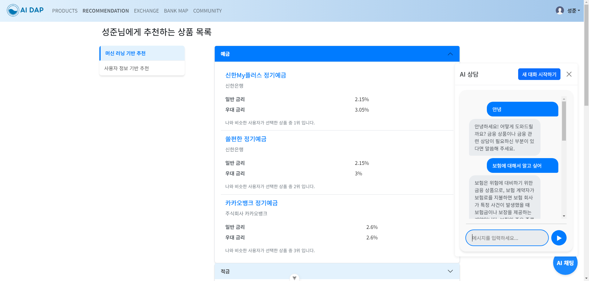

# 1. 팀원 정보 및 업무 분담 내역

### 조장: 김도형

- **Backend 전반**

### 조원: 이성준

- **Frontend 전반**

# 2. 설계 내용 (아키텍처 등) 및 실제 구현 정도

전반적인 기능 (아래 기술)은 거의 다 구현했으나, 예적금 기능과 주택 대출 상품을 결합하는 기능은 구현하지 못했습니다.

또한 카카오 회원 가입 시, 부족한 데이터 입력을 위해 회원 정보 수정 페이지로 자동 이동하는 기능을 구현하려고 했으나, 잘 되지 않아 회원 정보 데이터가 없더라도 사이트가 작동하는데 이상이 없도록 예외 처리를 했습니다.

# 3. 데이터 베이스 모델링(ERD)


```
src/
├── app/
│   ├── providers/
│   │   └── router.js
│   ├── styles/
│   └── App.vue
**│       ├── RouterView**
│       ├── TheNavigationViewPage/
│       ├── TheFooterViewPage/
│       └── AiChatPage/
│
**├── RouterView/**
│   ├── HomePage/
│   │   ├── TodayExchangeRatePage/
│   │   ├── TodayNewsPage/
│   │   │   └── TodayNewsThumbnailsPage/
│   │   └── TodayKeywordPage/
│   │ 
│   ├── BankMapPage/
│   │ 
│   ├── ExchangeRatePage/
│   │   └── ExchangeRateItemViewPage/
│   │ 
│   ├── AuthPages/
│   │   ├── LoginPage/
│   │   ├── RegisterPage/
│   │   └── KakaoCallbackPage/
│   │ 
│   ├── ProfilePages/
│   │   ├── ProfilePage/
│   │   ├── ModifyProfilePage/
│   │   └── SignOutPage/
│   │ 
│   ├── ProductPages/
│   │   └── ProductListPage/
│   │       ├── DepositProductPage/
│   │       │    └── DepositProductDetailViewPage/
│   │       ├── SavingProductPage/
│   │       │    └── SavingProductDetailViewPage/
│   │       └── MortgageProductPage/
│   │            └── MortgageProductDetailViewPage/
│   │ 
│   ├── CommunityPages/
│   │   ├── CommunityMainPage/
│   │   ├── CommunityDetailPage/
│   │   ├── CreateArticlePage/
│   │   ├── ModifyArticlePage/
│   │   └── CommunityListPages/
│   │       ├── CommunityListAllPages/
│   │       ├── CommunityListFreePages/
│   │       ├── CommunityListNoticeages/
│   │       ├── CommunityListAskPages/
│   │       └── CommunityListReviewPages/
│   │ 
│   └── RecommendPages/
│       └── RecommendMainPage/
│           ├── RecommendForYouPage/
│           └── RecommendUserInfoPage/
│   
├── widgets/
│   ├── Footer/
│   ├── AIChat/
│   └── Navigation/
│   
└── features/
    ├── auth/
    ├── profile/
    ├── bankMap/
    ├── exchangeRate/
    ├── productList/
    ├── community/
    └── recommend/
```

# 4. 금융 상품 추천 알고리즘에 대한 기술적 설명

```python
# ML Model 학습을 위한 더미데이터 생성
# 변수를 생성하고 범주화
    def _prepare_user_features(self, user):
        """사용자 특성 벡터 생성"""
        age = (pd.Timestamp.now() - pd.Timestamp(user.birthdate)).days // 365
        
        # 소득 수준 계산 (1-10)
        income_level = min(user.annual_income // 10000000, 10)
        
        # 자산 수준 계산 (1-10)
        asset_level = min(user.assets // 100000000, 10)
        
        # 투자성향 수치화
        risk_scores = {
            'CONSERVATIVE': 1,
            'MODERATE': 2,
            'AGGRESSIVE': 3,
            'SPECULATIVE': 4
        }
        risk_score = risk_scores[user.investment_type]
        
        features = [
            age,
            income_level,
            asset_level,
            risk_score
        ]
        
        return np.array(features).reshape(1, -1)
        
 # 표준화 후 RandomForest 학습
   def _train_models(self):
        """모델 훈련"""
        self.scaler = StandardScaler()
        
        # 각 상품 유형별 모델 훈련
        for product_type in self.models.keys():
            X_train, y_train = self._generate_dummy_data(product_type)
            X_scaled = self.scaler.fit_transform(X_train)
            
            model = RandomForestClassifier(
                n_estimators=100,
                max_depth=5,
                random_state=42
            )
            model.fit(X_scaled, y_train)
            self.models[product_type] = model
            
            # 모델 저장
            if not os.path.exists(self.model_path):
                os.makedirs(self.model_path)
                
            joblib.dump(self.scaler, os.path.join(self.model_path, 'scaler.pkl'))
            joblib.dump(
                model, 
                os.path.join(self.model_path, f'{product_type}_model.pkl')
            )
            
 # 유의수준 0.05수준으로 95%확률로 성향에 맞는 상품 선택
 # 5% 확률로 성향에 맞지 않는 상품을 선택
 # 획일적이지 않게 현실을 반영한 더미데이터 생성을 위함 
    def _generate_dummy_data(self, product_type, n_samples=1000000):
        """더미 데이터 생성"""
        np.random.seed(42)
        
        # 특성 생성
        ages = np.random.normal(40, 10, n_samples).clip(20, 80)
        income_levels = np.random.randint(1, 11, n_samples)
        asset_levels = np.random.randint(1, 11, n_samples)
        risk_scores = np.random.randint(1, 5, n_samples)
        
        X = np.column_stack([ages, income_levels, asset_levels, risk_scores])
        
        # 상품 ID 가져오기
        if product_type == 'deposit':
            products = DepositProducts.objects.all()
        elif product_type == 'saving':
            products = SavingProducts.objects.all()
        else:
            products = MortgageProducts.objects.all()
            
        product_ids = [p.id for p in products]
        
        if not product_ids:
            raise ValueError(f"No {product_type} products found in database")
        
        # 규칙 기반 더미 데이터 생성
        y = []
        for i in range(n_samples):
            age = ages[i]
            income = income_levels[i]
            assets = asset_levels[i]
            risk = risk_scores[i]
            
            # 상품 선택 로직
            if product_type == 'deposit':
                if risk <= 2:  # 안정 선호
                    weights = [0.95 if p.join_deny == 1 else 0.05 for p in products]
                else:  # 위험 선호
                    weights = [0.95 if hasattr(p, 'depositoptions') and 
                             p.depositoptions.filter(intr_rate__gt=3).exists() 
                             else 0.05 for p in products]
            
            elif product_type == 'saving':
                if risk <= 2:  # 안정 선호
                    weights = [0.95 if p.join_deny == 1 else 0.05 for p in products]
                else:  # 위험 선호
                    weights = [0.95 if hasattr(p, 'savingoptions') and 
                             p.savingoptions.filter(intr_rate__gt=4).exists() 
                             else 0.05 for p in products]
            
            else:  # mortgage
                if assets >= 5:  # 자산이 많은 경우
                    weights = [0.95 if hasattr(p, 'mortgageopions') and 
                             p.mortgageotions.filter(lend_rate_min__lt=4).exists() 
                             else 0.05 for p in products]
                else:
                    weights = [1/len(products)] * len(products)
            
            # 가중치 정규화
            weights = np.array(weights) / sum(weights)
            
            # 가중치 기반 무작위 선택
            y.append(np.random.choice(product_ids, p=weights))
            
        return X, np.array(y)
 
 # 사용자 데이터 스케일링 후 학습된 모델로 상품 예측
 # 유사한 더미 데이터와의 코사인 유사도 기준으로 상품 추천 
 
     def get_recommendations(self, user, n_recommendations=3):
        """사용자 기반 추천"""
        user_features = self._prepare_user_features(user)
        user_features_scaled = self.scaler.transform(user_features)
        
        recommendations = {}
        for product_type, model in self.models.items():
            if product_type == 'mortgage' and user.assets < 100000000:
                recommendations[product_type] = []
                continue
                
            # 각 상품에 대한 확률 예측
            probabilities = model.predict_proba(user_features_scaled)[0]
            top_n_indices = np.argsort(probabilities)[-n_recommendations:]
            
            # 상품 ID 가져오기
            product_ids = model.classes_[top_n_indices]
            
            # 상품 정보 조회
            if product_type == 'deposit':
                products = DepositProducts.objects.filter(id__in=product_ids)
            elif product_type == 'saving':
                products = SavingProducts.objects.filter(id__in=product_ids)
            else:
                products = MortgageProducts.objects.filter(id__in=product_ids)
                
            recommendations[product_type] = list(products)
            
        return recommendations
```

# 5. 서비스 대표 기능들에 대한 설명

## 메인 페이지 관련

- 관심 집중을 위한, 배너 이미지 및 버튼 클릭 유도 디자인
    
    
    

## 계정 관련

- 기본적인 회원 가입, 로그인, 로그아웃, 회원 정보 수정, 회원 탈퇴 기능
- 카카오 계정으로 회원 가입 및 로그인 기능 구현
    
    
    
    
    
    
    
    
    

## 금융 상품 관련

### 조회

- 금융 감독원 API 활용

- 금융 상품 전체 조회 및 상세 조회 가능
    - 전체 페이지에서는 페이지네이션을 통한 가독성 증대와, 은행 이름 입력을 통한 서비스 검색 기능 제공
        
        
        
        
        
    
    - 상세 조회 페이지에서는 상품 제공자의 위치 정보 확인 가능
        
        
        
    
- 예금 상품:
    - 단리, 복리, 금리에 따른 예상 이자 계산 기능 제공
        
        
        
    
- 적금 상품:
    - 단리, 복리, 금리에 따른 예상 이자 계산 기능 제공
        
        
        

- 주택 담보 대출 상품:
    - 주택 가격 조회를 용이하게 하기 위한 외부 사이트 링크 제공 (호갱노노)
    - 대출 가능 여부와 예상 대출 이자를 계산할 수 있는 간단한 계산 기능 제공
        - 아파트 여부, 고정 / 변동 금리 여부에 따른 결과 제공
    
    
    

### 등록

- 상태 관리 시스템 제공
    - 가입 신청 → 가입 완료 → 만기 / 해지로 구분
    - 해지하더라도 가입 이력을 삭제하지 않음으로써, 기존 가입 이력 데이터를 활용한 추천 시스템 제공이 가능함
    
- 가입 시 이메일을 활용한 가입 알림 서비스 제공
    
    
    

## 커뮤니티 관련

- 게시글 및 댓글 CRUD 기능 구현

- 게시글 검색 기능, 페이지네이션 기능 구현
    
    
    

- 각 게시글에 좋아요 기능 구현
    
    
    

- 카테고리 별 게시글 분류 (공지, 자유, 질문, 후기, 기타)

- 공지 카테고리의 경우 관리자만 게시글을 작성할 수 있도록 제한

## 환전 관련

- 한국 수출입 은행 API 활용

- 실시간 환율 정보를 제공
    - 주말, 공휴일, 업무 시간 외의 경우에도 데이터를 제공할 수 있도록 하는 로직 구현
    
- 실시간 환율 정보를 바탕으로 한 원화 → 외화 / 외화 → 원화 환전 금액 계산기 구현
    
    
    

## 지도 관련

- Kakao Map API 활용

- 이름 및 현재 위치를 기반으로 한 은행 검색 기능 구현
    
    
    

- 각 상품의 상세 페이지에서도 키워드 검색 기능을 연동해, 바로 은행 위치 정보를 확인할 수 있도록 처리

## AI Chat 관련



- Open AI API 활용

- GPT-4 모델을 기반으로 한 금융 상담 서비스로 금융 전문 상담에 특화

- 플로팅 UI를 구현해, 어디서든 페이지 이동 없이 접근이 가능

- 창을 닫더라도 대화 Context가 유지되며, 필요 시 새로운 대화를 시작이 가능함

## 뉴스 관련


- 실시간 금융 뉴스 크롤링

- 각 title, 혹은 이미지를 클릭하면 해당 기사로 바로 이동이 가능함

- 자연어 처리를 기반으로 키워드 추출을 통해 실시간 인기 키워드 확인이 가능

# 6. 생성형 AI를 활용한 부분

## 서비스 관련

### AI Chat Bot 서비스

- GPT-4를 기반으로 한 모델에 금융 데이터를 학습시켜, AI 금융 상담을 가능하게 함

## 구현 관련

### 사이트 로고, 및 배너 이미지

- canva를 사용해, 사이트 로고를 만들고, 배너 이미지를 생성
    
    
    
    
    

## 코드 개선

- 배우지 못 했거나, 구현하기 어려웠던 부분에 있어서는 perplexity 및 claude, gpt-4o 등을 활용해 도움을 받았습니다.
    - 카카오 로그인 관련, 주택 담보 대출 관련한 계산 기능 등

# 7. 기타 (느낀 점, 후기 등)

## 김도형

이번 금융 프로젝트에서 Django 백엔드를 담당하면서 많은 것을 배웠습니다. 실제 프로젝트에 Django를 적용해보니, 이론으로만 알던 내용들이 실전에서 어떻게 활용되는지 체감할 수 있었습니다. 
또 팀 프로젝트를 통해 협업의 중요성을 몸소 체험했습니다. 서로 도와주며 소통하니 업무 부담도 줄었고, 어려운 부분도 쉽게 헤쳐나갈 수 있었습니다.
이번 경험은 제가 계획 중인 개인 프로젝트에 큰 도움이 될 것 같습니다. 이번에 얻은 도메인 지식과 기술적 경험을 잘 활용할 수 있을 것 같아 기대됩니다.
첫 팀 프로젝트였지만, 이를 통해 얻은 경험과 인사이트는 정말 값진 것들이었습니다. 앞으로 더 많은 프로젝트를 경험하며 성장해 나가고 싶습니다.

## 이성준
코딩을 SSAFY에 와서 처음 배우게 됐는데, 한 학기 동안 정말 많은 것을 배웠던 것 같습니다.
이번 최종 관통에서 그간 배운 것을 사용하면서 하고 싶었던 것을 구현하는 게 정말 재미있었습니다. 
특히 기존과 달리 팀원과 함께 업무를 분담하고, 제가 부족한 부분을 팀원이 보완시켜주고, 저도 도와줄 수 있는 부분은 도와주면서  소통하면서 프로젝트를 발전시켜 나가는 게 정말 즐거웠던 것 같습니다.
이번 프로젝트를 통해서 제가 부족한 부분도 많이 깨달을 수 있었고, 많은 것을 배울 수 있었던 것 같습니다. 다음 2학기에서 진행할 여러 프로젝트에서도 다른 팀원들에게 누를 끼치지 않으며 점점 발전해야겠다는 생각을 할 수 있었던 것 같습니다.